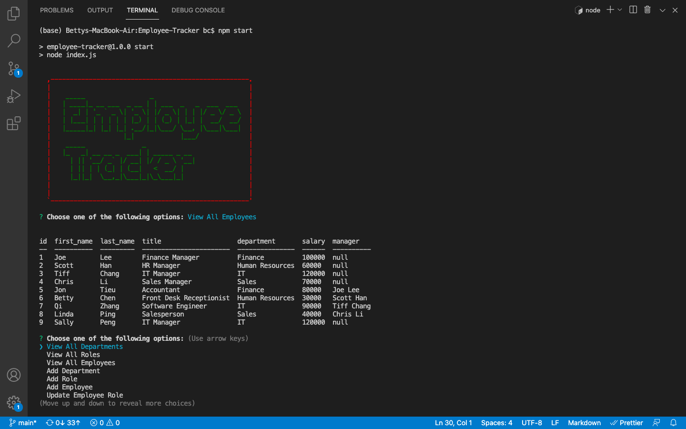

# Employee Tracker

## Description

This project uses Node.js, Inquirer and MySQL to manage a company's employee database. The users are able to view and manage the departments, roles, and employees in their company for organization and planning of their business.

## Installations

npm init -y

npm install inquirer

npm install mysql2

npm install console.table

npm install asciiart-logo

## Usage

In the correct folder of your project, open the terminal and run the command, node index.js or npm start, and choose the preferred options when prompted.

### Screenshots of Project

### Video Link of Project

Click [here](https://drive.google.com/file/d/1Pf0KAXNWL5qTSOv_jm-EDeKhBawXzdfA/view)!

## License

 
Copyright © 2021 [Betty Chen](https://github.com/bchen41).  
This project is [MIT](https://github.com/bchen41/Employee-Tracker/blob/main/LICENSE) licensed.

## Contributing

All are welcomed to contribute as long as the standard industry guidelines are being followed.
Click [here](https://www.contributor-covenant.org/) for industry standard guidelines.

## Questions

For additional questions, contact me by reaching me at my [email](mailto:bettychen41@outlook.com).

You can find my other projects at my [GitHub](https://github.com/bchen41) profile.

Author: Betty Chen
